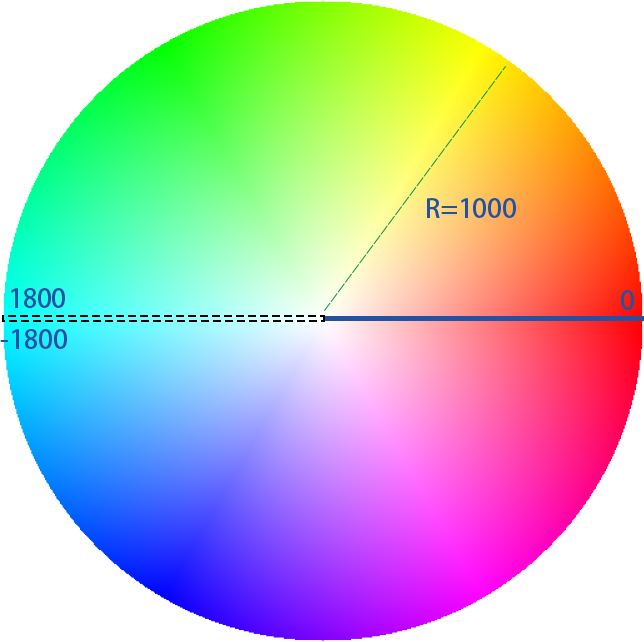

<!--
 * @Date: 2024-05-10 14:28:44
 * @Author: DarkskyX15
 * @LastEditTime: 2024-07-13 01:36:29
-->

# Core.Utils  

*内置工具类函数*  

目录：  

- [bfs 宽度优先搜索](#coreutilsbfs)  
- [check_point 检查点](#coreutilscheckpoint)
- [color_panel 调色盘](#coreutilscolorpanel)
- [cos 余弦](#coreutilscos)
- [for_each 列表循环](#coreutilsforeach)
- [len 列表长度](#coreutilslen)
- [linear_map 线性映射](#coreutilslinearmap)
- [make_match 随机配对](#coreutilsmakematch)
- [pillar_check 竖直方块检查](#coreutilspillarcheck)
- [rand 旧随机数](#coreutilsrand-已弃用)
- [range 范围列表生成](#coreutilsrange)
- [sbs 计分板冒泡排序](#coreutilssbs)
- [shuffle 随机打乱](#coreutilsshuffle)
- [sight_cast 视线投射](#coreutilssightcast)
- [sin 正弦](#coreutilssin)
- [sqrt 开平方根](#coreutilssqrt)
- [timer 计时器](#coreutilstimer)
- [to_bin 十进制转二进制](#coreutilstobin)
- [uuid_match UUID匹配](#coreutilsuuidmatch)

## Core.Utils.BFS

在世界范围内提供基于方块网格的宽度优先搜索。  
对于所有搜索到的方块，在其位置有`minecraft:marker`作为标记。对于每一个`minecraft:marker`，在其实体NBT中有数据值`data.depth`表示从起点到该点的深度。  
该函数的行为大部分可自定义，关于自定义搜索标准，见[自定义搜索标准](#bfs-自定义搜索标准)。

### BFS 参数列表

*参数名仅在说明文档中起方便指代的作用，与参数在实际储存或计分板中的路径无关，与函数传参的参数名也无必然对应关系。敬请注意，之后不再说明。*  

|参数名|参数类型|作用|备注|
|--|--|--|--|
|x_pos|double|起始x坐标|-|
|y_pos|double|起始y坐标|-|
|z_pos|double|起始z坐标|-|
|x_range|list[int]|搜索到的方块在X轴上与起点坐标差值的合法区间|只取列表前2项，左闭右闭|
|y_range|list[int]|同上，但在Y轴上|同上|
|z_range|list[int]|同上，但在Z轴上|同上|
|max_depth|int|合法方块的最大深度|-|
|max_steps|int|搜索进行的最多步数|-|
|direction|int(bit field)|合法的搜索方向|详细见[方向参数](#bfs-方向参数)|
|pred_path|string(函数路径)|自定义搜索函数谓词的路径|参考[函数谓词](#appendix-函数谓词)|

### BFS 返回机制

bfs工具不使用函数返回值。  
对于任意一个`do`函数（`do_with_entity`或`do_with_pos`），其运行完成后将会在搜索到的合法方块处生成带有`cu_bfs_ptr`计分板标签的`minecraft:marker`实体，在其实体NBT中有数据值`data.depth`表示从起点到该点的深度。在这之后使用者可以通过`@e[type=minecraft:marker, tag=cu_bfs_ptr]`选中，进行进一步的操作。  
在所有操作进行完毕后，请使用`mmt_core:utils/bfs/clear`清除所有生成的`minecraft:marker`。  

### BFS do_with_entity

- 函数路径：`mmt_core:utils/bfs/do_with_entity`  
- 参数：无需传参  

以执行者所在位置为起点进行搜索。

### BFS do_with_pos

- 函数路径：`mmt_core:utils/bfs/do_with_pos`
- 参数：`{x(x_pos), y(x_pos), z(z_pos)}`

以给定坐标为起点进行搜索，给定的位置需要被加载。  

### BFS clear

- 函数路径：`mmt_core:utils/bfs/clear`
- 参数：无需传参

清除已经生成的搜索标记。

### BFS show_ptr

- 函数路径：`mmt_core:utils/bfs/show_ptr`
- 参数：无需传参

以渐变色显示搜索标记，颜色基于标记的搜索深度计算。  
**注意：** 持续显示需要循环执行该函数。

### BFS setting_reset

- 函数路径：`mmt_core:utils/bfs/setting_reset`
- 参数：无需传参

重置bfs设置至默认值。

### BFS setting

- 函数路径：`mmt_core:utils/bfs/setting_reset`
- 参数：`{x(x_range), y(y_range), z(z_range), max_depth(max_depth), max_steps(max_steps), direction(direction), on_block(pred_path)}`

修改bfs设置。  

### BFS 自定义搜索标准

自定义搜索标准通过调整`pred_path`参数指向的函数谓词达成。  

对于熟悉NBT储存操作的使用者，可以直接修改`mcmmt:core_utils search.on_block`。  
否则可以使用`mmt_core:utils/bfs/setting`函数，传入参数`on_block`进行修改。  

对于`pred_path`指向的函数谓词，其执行位置为一个当前搜索到的方块位置，无传入参数。谓词应该判断该方块是否符合搜索标准。  
可以参考`mmt_core/functions/utils/bfs/private/presets`中的预设函数谓词。

### BFS 方向参数

`direction`参数为`int`类型，其32位二进制形式中的每一位代表一个方向是否合法。`direction`参数的默认值为`63`。  
对于每一个方块，取以其为中心的3x3x3的立方体，除去其本身，剩余26个方块代表26个方向。

|二进制位（从低至高）|相对坐标|/|二进制位（从低至高）|相对坐标|
|--|--|--|--|--|
|0|~ ~ ~-1|/|1|~ ~ ~1|
|2|~ ~-1 ~|/|3|~ ~1 ~|
|4|~1 ~ ~|/|5|~-1 ~ ~|
|6|~ ~-1 ~-1|/|7|~ ~1 ~1|
|8|~ ~1 ~-1|/|9|~ ~-1 ~1|
|10|~-1 ~ ~1|/|11|~-1 ~ ~-1|
|12|~1 ~ ~1|/|13|~1 ~ ~-1|
|14|~1 ~1 ~|/|15|~-1 ~-1 ~|
|16|~-1 ~1 ~|/|17|~1 ~-1 ~|
|18|~1 ~1 ~1|/|19|~-1 ~-1 ~-1|
|20|~-1 ~1 ~1|/|21|~1 ~-1 ~1|
|22|~1 ~1 ~-1|/|23|~-1 ~-1 ~1|
|24|~-1 ~1 ~-1|/|25|~1 ~-1 ~-1|

## Core.Utils.CheckPoint

提供通用的检查点支持。  
在可能情况下，应在使用前召唤所有需要的检测点，并在使用完毕后清除所有检测点。

### CP 参数列表

|参数名|参数类型|作用|备注|
|--|--|--|--|
|position|list[double]|含3个double类型数据依次表示x,y,z坐标|-|
|point|{pos(position), ...}|表示一个检查点，其中`pos`为必须项，其值代表了检查点的传送坐标。|-|
|points|list[point]|point列表，表示一系列检查点|-|
|point_id|int|检查点id|-|
|force_ascend|int|是否强制检查点id升序（即玩家不能返回之前已到达的检查点）|以0/1表T/F|
|callback|string(函数路径)|指向玩家到达检查点时触发的函数|-|
|summon_data|{multi_pos(list[position]), id(point_id)}|multi_pos表示所有检测点的坐标列表，这些检测点都属于id编号的检查点|-|
|summon_list|list[summon_data]|多个检测点配置的列表，用于批量生成检测点|-|

### CP 使用流程

check_point工具不直接使用函数返回值。  

使用check_point工具时，请先给需要追踪检查点的玩家添加`mmt_cp_user`的计分板标签，然后使用`mmt_core:utils/check_point/setup`函数配置工具参数以及各个检查点的信息。在这之后，多次使用`mmt_core:utils/check_point/create`创建检测点，或使用批量生成工具`mmt_core:utils/check_point/batch`生成检测点。最后使用`mmt_core:utils/check_point/run`启动检测循环。  

不再需要使用检查点后，调用函数`mmt_core:utils/check_point/reset`来重置。使用`reset`函数将会停止检测循环，删除所有检测点，清除所有玩家的`mmt_cp_user`的计分板标签，并重置所有玩家的检查点进度。  

对于每个拥有`mmt_cp_user`计分板标签的玩家，可以以自身为执行者调用`mmt_core:utils/check_point/back`来返回最近一次到达的检查点指定的位置。  

关于检测点与检查点的区别，请参考[检测点与检查点](#cp-检测点与检查点)。  
关于如何设置检查点，请参考[配置检查点](#cp-配置检查点)。  
关于如何自定义触发检查点时的行为，请参考[自定义检查点行为](#cp-自定义检查点行为)。

### CP back

- 函数路径：`mmt_core:utils/check_point/back`
- 参数：无需传参

将自身传送回最近一次到达的检查点指定的位置。

### CP batch

- 函数路径：`mmt_core:utils/check_point/batch`
- 参数：`{summon_list(summon_list)}`

批量生成检测点。

### CP create

- 函数路径：`mmt_core:utils/check_point/create`
- 参数：`{point_id(point_id)}`

在执行者位置生成检测点，属于`point_id`指定的检查点。  
**注意：** 该函数使用了坐标对齐，生成的检测点位置将与方块中心对齐。  

### CP display

- 函数路径：`mmt_core:utils/check_point/display`
- 参数：无需传参

切换是否显示检测点。属于同一检查点的检测点显示颜色相同，显示颜色基于检查点id计算。  
**注意：** 检测循环启动后才能显示检测点。

### CP reset

- 函数路径：`mmt_core:utils/check_point/reset`
- 参数：无需传参

重置检查点工具，将会停止检测循环，删除所有检测点，清除所有玩家的`mmt_cp_user`的计分板标签，并重置所有玩家的检查点进度。  
**注意：** 该函数不会重置检查点配置。

### CP run

- 函数路径：`mmt_core:utils/check_point/run`
- 参数：无需传参

启动检测循环。

### CP setup

- 函数路径：`mmt_core:utils/check_point/setup`
- 参数：`{points(points), callback(callback), force_ascend(force_ascend)}`

更改检查点工具设置，重新配置检查点。

### CP 检测点与检查点

检测点以`minecraft:marker`为载体实际存在在游戏中，检查点无实际载体。  

不同的检查点拥有不同且唯一的检查点id，且有唯一的配置项(point)与其对应。对于检测点，不同的检测点可以有相同的检查点id，代表他们同属于一个检查点。  

基于这样的设计，使用者可以像使用方块一样生成多个检测点，以自定义每个检查点检测区域的具体形状。

### CP 配置检查点

通过调用`mmt_core:utils/check_point/setup`函数，传入`points`参数，可以配置检查点。对于熟悉储存操作的使用者，可以直接修改`mcmmt:core_utils check_point.points`来配置检查点。

对于每一个检查点，有唯一的配置项(point)，例子如下：

```snbt
{name:"example", pos:[0, 100, 0]}
```

该配置项中`pos`为必须项，表示玩家到达该检查点后，调用`mmt_core:utils/check_point/back`应将其传送至的坐标。其他项，如本例中`name`项，可以任意添加，作为检查点的自定义数据。  

多个point配置项形成points列表，如：

```snbt
[{name:"example1", pos:[0, 100, 0]}, {name:"example2", pos:[10, 100, 10]}]
```

检查点的唯一id由其配置项在列表中的下标确定。  

每个检查点的配置项会在玩家到达此检查点时作为参数传递给自定义的回调函数，因此，自定义的检查点参数配合自定义回调函数可以自定义该工具函数的绝大多数行为。详细信息参考[自定义检查点行为](#cp-自定义检查点行为)。

### CP 自定义检查点行为

使用`mmt_core:utils/check_point/setup`函数时传递的`callback`参数指向自定义的回调函数。通过修改回调函数，可以自定义到达检查点时的行为。  

当玩家到达检查点时（严格来说是检查点进度更新时），自定义的回调函数会被触发，同时，玩家到达的检查点所依赖的配置项也会被传递给回调函数。回调函数的执行者和执行位置均为到达检查点的玩家本身。  

自行编写回调函数可以参考默认回调函数：`mmt_core:utils/check_point/private/default_callback`  

## Core.Utils.ColorPanel

提供类似调色盘的颜色计算支持。  
rgb值在工具储存中以最大值1.0的实数值提供，在工具计分板中以最大值255的整数值提供。计算颜色需要提供`angle`与`distance`两个参数。  

### CLP 参数列表

|参数名|参数类型|作用|备注|
|--|--|--|--|
|angle|float|计算需要参数，取值范围：[-180.0, 180.0]|详见[计算规则](#clp-计算规则)|
|distance|int|计算需要参数，取值范围：[0, 1000]|同上|
|particle|string|粒子ID|-|
|args|string|剩余参数|详见[particle](#clp-particle)|

### CLP 使用指引

使用调色盘工具时，可以通过调用`mmt_core:utils/color_panel/get`函数，传入`distance`和`angle`函数来计算颜色。对于熟悉计分板操作，或是希望减少性能消耗的使用者，推荐直接设置工具计分板中`distance`和`angle`计分项（此时`angle`参数需要乘以10传入），然后调用`mmt_core:utils/color_panel/private/calc_color`计算颜色。  

使用输出结果时，以最大值1.0的实数值代表的R（G/B）值存放于`mcmmt:core_utils color_panel.r(g/b)`中，以最大值255的整数值代表的R（G/B）值存放于`core_utils_color_panel`计分板的计分项`red(green/blue)`中。

### CLP get

- 函数路径：`mmt_core:utils/color_panel/get`
- 参数：{angle(angle), distance(distance)}

计算对应的颜色值。

### CLP particle

- 函数路径：`mmt_core:utils/color_panel/particle`
- 参数：{particle(particle), args(args)}

为方便生成计算所得颜色粒子而设计的工具函数。  
该函数本质上将计算出的颜色值传入`/particle`命令中，并以`args`参数补齐后续缺少的命令参数。  

例如，生成`minecraft:dust`粒子：

```mcfunction
# 原命令
particle minecraft:dust 1 1 1 1.4 ~ ~ ~ 0 0 0 1 1 force @a
# 使用 mmt_core:utils/color_panel/particle
function mmt_core:utils/color_panel/particle {particle:"minecraft:dust", args:"1.4 ~ ~ ~ 0 0 0 1 1 force @a"}
# 上述命令会使用上一次计算所得的颜色值作为粒子的颜色
```

### CLP 计算规则

颜色计算方法基于[CSDN博客](https://blog.csdn.net/raynadofan/article/details/126521974)。

参数含义 & 效果例图：  


`distance`即到圆心的距离，`angle`在计算前会乘以10（即参数传入时保留一位小数的精度）。

## Core.Utils.Cos

提供基于打表的余弦值计算。  
提供的接口与`Core.Utils.Sin`完全一致，请参考其文档。  

- `mmt_core:utils/cos_do`
- `mmt_core:utils/cos_with_score`

## Core.Utils.ForEach

## Core.Utils.Len

## Core.Utils.LinearMap

## Core.Utils.MakeMatch

## Core.Utils.PillarCheck

## Core.Utils.Rand (已弃用)

提供旧的基于线性同余方法的随机数生成。

**可用方法：**  

- `mmt_core:utils/rand_generate`  
  生成下一个随机数，保存在计分板`core_utils_rand -> result`中和储存的`mcmmt:core_utils -> rand.result`中。
- `mmt_core:utils/rand_bound_reset`  
  重置随机数生成的上下限，默认为[0 ~ 99999999]  
- `mmt_core:utils/rand_adjust_bound`  
  调整随机数生成的上下限，**需要传入参数。**  
  例子:  

  ```mcfunction
  # lower：下限
  # upper：上限 
  function mmt_core:utils/rand_adjust_bound {lower:0, upper:100}
  ```

*备注：* 不建议调整上下限，避免为放置影响其他命令而使用重置上下限导致的性能消耗。

## Core.Utils.Range

## Core.Utils.SBS

## Core.Utils.Shuffle

## Core.Utils.SightCast  

提供通用的视线投射函数（正常应该能适配所有实体）。

**可用方法：**  

- `mmt_core:utils/sight_cast_start`  
  在该命令执行者处执行视线投射。  
  返回数据保存如下：  

  |含义|计分板路径|储存路径|
  |--|--|--|
  |是否成功（0/1）|`core_utils_scast -> scast_success`|`mcmmt:core_utils -> sight_cast.success`|
  |迭代次数（步长0.5）|`core_utils_scast -> scast_last_iter`|`mcmmt:core_utils -> sight_cast.iter_cnt`|
  |结束位置|不储存|`mcmmt:core_utils -> sight_cast.end_pos`|
  |视线角度|不储存|`mcmmt:core_utils -> sight_cast.rotation`|

  结束处有标签为`sight_cast_ptr_end`的盔甲架供下一步操作使用。

- `mmt_core:utils/sight_cast_clear`  
  清除所有已结束的视线投射标记，即清除所有带`sight_cast_ptr_end`标签的盔甲架。  
  该函数应该在执行视线投射并进行了后续操作后立刻执行，以避免标记滞留带来的意外影响。

- `mmt_core:utils/sight_cast_adjust_bound`  
  调整视线投射的最多迭代次数，每次迭代前进0.5单位距离，默认最多100次。  
  **需要传入参数。** 例子：

  ```mcfunction
  # max_iteration 最大迭代次数
  function mmt_core:utils/sight_cast_adjust_bound {max_iteration:200}
  ```

**使用样例：**  

```mcfunction
# 为有what_player的玩家使用视线投射
tag @a[tag=what_player] add use_sight_cast
execute as @a[tag=use_sight_cast] at @s run function mmt_core:utils/sight_cast_start
# 在视线投射的结束处放置tnt
execute as @e[type=armor_stand, tag=sight_cast_ptr_end] at @s run setblock ~ ~ ~ tnt
# 清除投射标记
function mmt_core:utils/sight_cast_clear
```

## Core.Utils.Sin

提供基于打表的正弦值计算。  
输入的角度值在计算过程中只保留一位精度。  
结果精度保留到小数点后6位。  

**可用方法：**  

- `mmt_core:utils/sin_do`  
  **需传入参数。** 例子：

  ```mcfunction
  # degree 角度值
  function mmt_core:utils/sin_do {degree:22.5f}
  ```

  返回的数据值如下：  
  |数据|计分板路径|储存路径|
  |--|--|--|
  |正弦值|`core_utils_sincos -> result`|`mcmmt:core_utils -> sincos.result`|
  |结果放大系数（针对计分板数据）|`core_utils_sincos -> scaler`|无|

- `mmt_core:utils/sin_with_score`  
  针对计分板特化的调用接口，注意传入的计分板数据应该为扩大10倍后的整数角度值。  

  ```mcfunction
  # subj 追踪项
  # obj 计分板名称
  function mmt_core:utils/sin_with_score {subj:test, obj:test_board}
  ```

## Core.Utils.Sqrt

提供基于牛顿迭代法的开根号实现。  
需开根号的值小于等于0时，返回0。

**可用方法：**

- `mmt_core:utils/sqrt_do`  
  计算传入参数值的平方根。  
  返回数据储存如下：  

  |数据|计分板|储存|
  |--|--|--|
  |计算结果（计分板为放大后整数）|`core_utils_sqrt -> result`|`mcmmt:core_utils -> sqrt.result`|
  |倍率系数（计分板中为放大系数`N`，储存中为`1/N`）|`core_utils_sqrt -> scaler`|`mcmmt:core_utils -> sqrt.scaler`|  

  **需传入参数：** 例子：

  ```mcfunction
  # value 需要开平方的参数
  function mmt_core:utils/sqrt_do {value:10}
  ```

- `mmt_core:utils/sqrt_with_score`  
  为计分板特化的调用接口。  
  **需传入参数：** 例子：

  ```mcfunction
  # subj 追踪项名称
  # obj 计分板名称
  function mmt_core:utils/sqrt_with_score {subj:test, obj:data_store}
  ```

**使用示例：**

```mcfunction
scoreboard players set test data_store 114
execute store result storage mcmmt:core_utils sqrt.value int 1.0 run scoreboard players get test data_store
# 或 function mmt_core:utils/sqrt_with_score {subj:test, obj:data_store}
function mmt_core:utils/sqrt_do with storage mcmmt:core_utils sqrt
data modify entity @e[limit=1, type=armor_stand] Motion[] set from storage mcmmt:core_utils sqrt.result
```

## Core.Utils.Timer

## Core.Utils.ToBin

提供十进制向二进制的转换。  
转换后结果将以32位Byte数组保存在储存的`mcmmt:core_utils.to_bin.bin`路径，或每一位以追踪项名`pos{位置}`储存在计分板`core_utils_to_bin`中。  

例如：  
对于十进制数5，其二进制表示为101。则函数运行后有以下结果：  
在mcmmt:core_utils.to_bin.bin: `[B; 1b,0b,1b,0b,0b,0b,0b,0b,0b,0b,0b,0b,0b,0b,0b,0b,0b,0b,0b,0b,0b,0b,0b,0b,0b,0b,0b,0b,0b,0b,0b,0b]`。  
在计分板core_utils_to_bin：pos0、pos2为1，其余pos3~pos31与pos1都为0。  

**可用方法：**

- `mmt_core:utils/to_bin`  
  **需要传入参数。** 例子：  

  ```mcfunction
  # value: 需要转成二进制的十进制数。
  function mmt_core:utils/to_bin {value: 5}
  ```

- `mmt_core:utils/to_bin_with_score`  
  使用计分板参数的特化方法。  
  **需要传入参数。** 例子：  

  ```mcfunction
  # subj 追踪项名
  # obj 计分板名
  function mmt_core:utils/to_bin {subj: test, obj: test_board}
  ```

## Core.Utils.UUIDMatch

提供UUID比较。

**可用方法：**

- `mmt_core:utils/uuid_match_set`  
  **需传入参数。**  
  设置UUID匹配的目标。  
  传入的`Compound`类型NBT标签中，必须含有`UUID`标签。  
  例子：  

  ```mcfunction
  # 对于直接使用实体的UUID
  function mmt_core:utils/uuid_match_set with entity @s
  # 对于使用其他标签内的UUID
  # 此处@s假设为 minecraft:ocelot
  data modify storage mcmmt:core_utils uuid_match.UUID set from entity @s LoveCause
  function mmt_core:utils/uuid_match_set with storage mcmmt:core_utils uuid_match
  ```

- `mmt_core:utils/uuid_match_pred`  
  类似谓词设计的UUID比较检测。  
  若命令执行者的UUID与设置的UUID匹配目标一致，返回1，否则返回fail。例子：  

  ```mcfunction
  execute as @e[type=minecraft:ocelot] if function mmt_core:utils/uuid_match_pred run say It's me!
  ```

## appendix 函数谓词

*该名词仅作用于`Core.Utils`内，不代表其他任何组织或个人的定义。*  

函数谓词属于函数，指一类总是返回0/1表`True`或`False`的函数，在`Core.Utils`中一般被用于自定义函数的行为。

例子：

```mcfunction
$scoreboard players set temp test $(score)
execute if score temp test matches -5..5 run return 1
return fail
```

该函数谓词接收参数`score`，预注册计分板`test`，当参数`score`在-5到5之间时，谓词判断条件为真。
